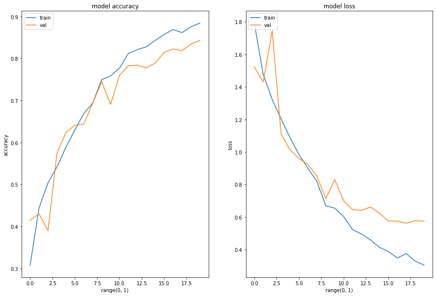

# Melanoma Skin Cancer Detection

## Abstract
Melanoma is the deadliest form of skin cancer. Melanoma is curable if it gets identified at the early stages. The first step of Melanoma skin cancer diagnosis is to conduct a visual examination of the skin's affected area. Dermatologists take the dermatoscopic images of the skin lesions by the high-speed camera, which have an accuracy of 65-80% in the melanoma diagnosis without any additional technical support. With further visual examination by cancer treatment specialists and dermatoscopic images, the overall prediction rate of melanoma diagnosis raised to 75-84% accuracy. The project aims to build an automated classification system based on image processing techniques to classify skin cancer using skin lesions images.

## Problem Statement
 The approach uses Convolutional Neural Network (CNN) to classify nine types of skin cancer from outlier lesions images. This reduction of a gap has the opportunity to impact millions of people positively.

## Dataset
The dataset consists of 2357 images of malignant and benign oncological diseases, which were formed from the International Skin Imaging Collaboration (ISIC). All images were sorted according to the classification taken with ISIC, and all subsets were divided into the same number of images.

### Sample image from Dataset

### Model Architecture

### Model Evaluation

